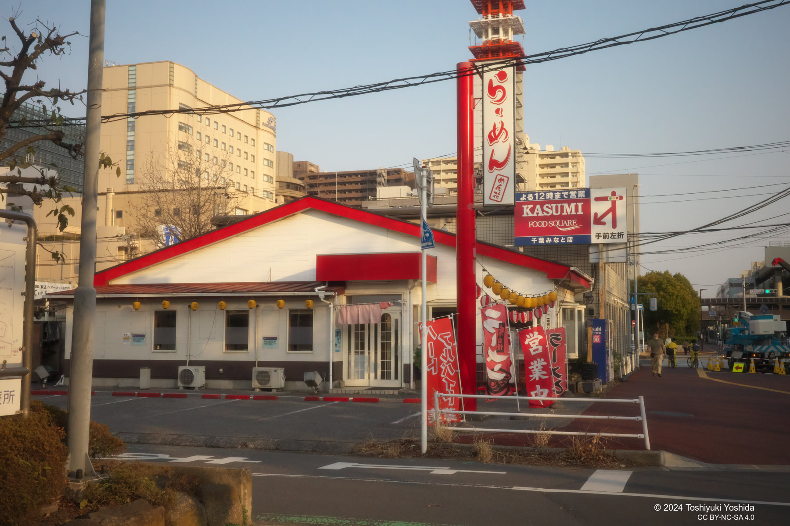

+++
title = "『御上先生』のラーメン店"
description = "近くのラーメン店にふらりとは言ったら、なんとドラマ『御上先生』のロケが行われたお店でした。"
date = 2025-03-17

[taxonomies]
tags = ["Gourmet", "Entertainment","Movies"]
[extra]
social_media_card = "ogp.webp"
+++

今クールのドラマの中では『御上先生』を一番楽しみにしています。
昨日放送されたEpisode9ではいろんな伏線が回収されて、
最終話に向けて盛り上げって居ます。

が、ふと、近くの「めん花」というラーメン屋さんに入ったら、
なんとこのラーメン屋さんで『御上先生』のロケが行われていたようです。

<!-- textlint-disable -->

{{ image(src="menka.jpg", alt="近くのラーメン店に飾られたサイン") }}

<!-- textlint-enable -->

昔からあるラーメン屋なので意外な気もしましたが、
町中でいい感じに庶民的なラーメン屋の雰囲気は確かにあまり他ではないかもしれま
せん。

<figure>
  
  <figcaption>めん花</figcaption>
</figure>

| 項目   | 内容                                                                                                       |
| ------ | ---------------------------------------------------------------------------------------------------------- |
| 店名   | HOTめん花                                                                                                  |
| 住所   | 千葉県千葉市美浜区幸町1-37-13                                                                              |
| 地図   | [OpenStreetMap](https://www.openstreetmap.org/?mlat=35.609007&mlon=140.101358#map=17/35.609007/140.101358) |
| 電話   | 043-245-9174                                                                                               |
| 定休日 | 無休                                                                                                       |
