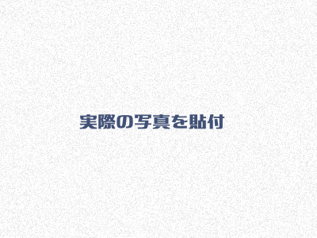

+++
title = "新DIPS包括申請と二等無人航空機操縦士"
description = "やっと二等無人航空機操縦士の技能証明書が郵送されてきたので、新DIPSで改正後の包括申請を行いました。"
date = 2025-04-10

[taxonomies]
tags = ["Certification", "Drone"]
[extra]
social_media_card = "ogp.webp"
+++

## 二等無人航空機操縦士技能証明書

<!-- textlint-disable -->

{{ image(src="lisence.webp", alt="二等無人航空機操縦士技能証明書") }}

<!-- textlint-enable -->

やっと届きました。

昨年末に思いついてスクールに通い始めて1月にスクールを卒業してから、3ヶ月も掛
かりました。スクールの実技試験枠が限られており試験を受けるのに2ヶ月、その後
海事協会の手続きとDIPS2.0での申請から発行まで1ヶ月かかりました。

## 包括申請

まだ自由に飛ばせません。
飛行許可の包括申請が必要です。

しかし、3月末にこの飛行許可と関連した申請方法に大きな改正がありました。
主な変更点は次のような点です。

- 機体と操縦者の許可基準適合性について
  - (改正前)写真や取扱説明書、飛行実績の貼付し申請が必要
  - (改正後)申請者自身で確認した結果を申請すればよく資料添付は不要

3月以前と大きく変わっているのですが、申請が簡素化されて大変楽にあっています。
これは審査を簡略化し許可まで時間の短縮が期待してのことだと思います。

この変更に対応して3月末にDIPS2.0の飛行許可申請の画面も大きく変わっています。
YouTubeを検索すれば入力方法を解説したビデオがたくさん出てくると思います。
これまで国土交通省で審査されていた部分が、自身で確認する必要があるため
、見落としや解釈間違いに注意してよく理解しましょう。

この申請も許可まで10開庁日必要なので、もうしばらくの我慢です。

## 基準適合書

申請に資料の貼付は不要になりましたが、国土交通省から照会がある可能性も有りま
す。その際に資料は作成・具備することになっているため、提出は不要ですが作成し
ておくことが求められています。

以下はDJI Air 3S用に作成したものです。以前DIPS2.0に登録していた資料と同等で
すね。

---

### 資料1: 無人航空機の機能・性能に関する基準適合確認書

<dl>
  <dt>製造者名</dt>
  <dd>DJI</dd>
  <dt>名称</dt>
  <dd>DJI Air 3S</dd>
  <dt>重量</dt>
  <dd>724g(取扱説明書)</dd>
  <dt>改造について</dt>
  <dd>
    航空局ホームページ掲載無人航空機ではないため未回答。
    次行に示す「仕様がわかる写真」にすべての機体構成を示す。
  </dd>
  <dt>仕様がわかる写真</dt>
  <dd>
    <table>
      <thead>
        <tr>
          <th colspan="2">無人航空機</th>
        </tr>
      </thead>
      <tbody>
        <tr>
          <th>正面</th>
          <td>
            
          </td>
        </tr>
        <tr>
          <th>側面</th>
          <td>
            
          </td>
        </tr>
        <tr>
          <th>上面</th>
          <td>
            
          </td>
        </tr>
      </tbody>
    </table>
    <table>
      <thead>
        <tr>
          <th colspan="2">操縦装置(DJI RC2)</th>
        </tr>
      </thead>
      <tbody>
        <tr>
          <th>正面</th>
          <td>
            
          </td>
        </tr>
      </tbody>
    </table>
  </dd>
</dl>

### 機体の運用限界に関する情報

<dl>
  <dt>最高速度</dt>
  <dd>75.6km/h</dd>
  <dt>最高到達高度</dt>
  <dd>6,000</dd>
  <dt>電波到達距離</dt>
  <dd>10,000</dd>
  <dt>飛行可能風速</dt>
  <dd>12m/s 以下</dd>
  <dt>最大搭載可能重量</dt>
  <dd>取扱説明等に記載なし</dd>
  <dt>最大使用時間</dt>
  <dd>45 分</dd>
</dl>

### 飛行させる方法

<dl>
  <dt>飛行させる方法</dt>
  <dd>モード 2</dd>
  <dt>操縦方法、点検・整備方法</dt>
  <dd>別途取扱説明書を保存</dd>
</dl>
