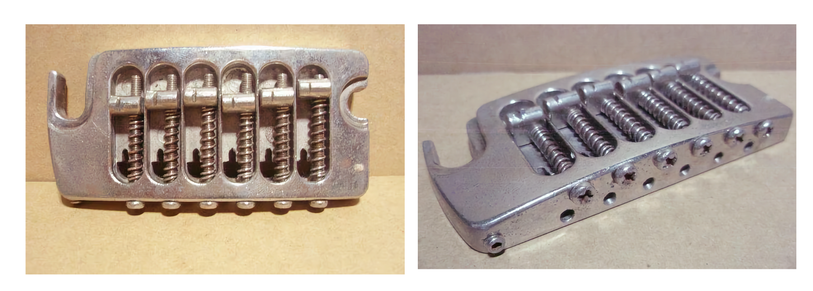
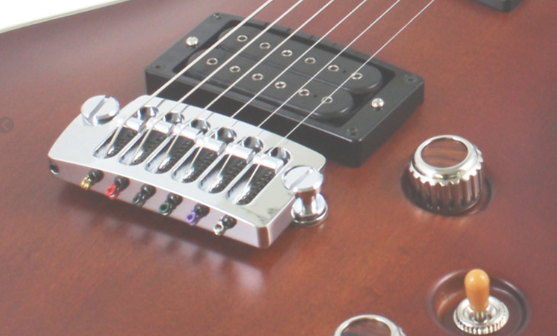

+++
title = "Aria Pro II PE-1500のブリッジについて"
description = "PE-1500RIにはオリジナルのブリッジが付いていますが、ずっと弦の貼り方を間違っていたことに1年近く経って気付きました。"
date = 2025-04-07

[taxonomies]
tags = ["Creative", "Guitar"]
[extra]
social_media_card = "ogp.webp"
+++

<!-- textlint-disable -->

{{ image(src="pe-1500.webp", alt="Aria Pro II PE1500RI") }}

<!-- textlint-enable -->

## Aria Pro II PE-1500RIとは

PEシリーズは、国産ブランド アリアプロⅡ が1976年に発表したモデルです。
その初代となる最上位機種が"PE-1500"で、トップ・バックと美しいアーチを描いた
メイプルボディに、メイプルネックです。
当時元バイオリンを制作していた現在はアトランシアを率いている林 信秋さんの
による設計でした。レスポールシェイプながら、
メープル単版カーブドトップ＆バック（両面削りだし）のボディからは、
レスポールとはまた違った明るい乾いた音でした。

PE-1500RIは、PE-1500のリシューモデルです。

<dl>
  <dt>Body</dt>
  <dd>Maple Carved Top/Back,Chambered block</dd>
  <dt>Neck</dt>
  <dd>Maple, Set-Neck, Heel-less Cutaway</dd>
  <dt>Fingerboard</dt>
  <dd>Madagascar Rosewood</dd>
  <dt>Frets</dt>
  <dd>22F</dd>
  <dt>Scale</dt>
  <dd>648mm</dd>
  <dt>Pickups</dt>
  <dd>Dimarzio Super Distortion Humbucking</dd>
  <dt>Controls</dt>
  <dd>1 Volume, 1 Tone, 3-way Selector SW</dd>
  <dt>Bridge</dt>
  <dd>Original "Super Matic" Bridge</dd>
  <dt>Machineheads</dt>
  <dd>Grover 102C</dd>
  <dt>Hardware</dt>
  <dd>Chrome</dd>
  <dt>Finish</dt>
  <dd>SBR(Stained Brown)</dd>
</dl>

## Super Matic Bridgeの弦の貼り方

このPE-1500はSuper Matic Bridgeというオリジナルのブリッジが採用されています。
テールピースとブリッジが一体化したもので、1970年代の「オリジナルを作ろう」と
いう気概を感じます。リシューモデルも金型から作って復刻されています。

以下のような形をしています。

<figure>
  
  <figcaption>Super Matic Bridige</figcaption>
</figure>

上面から見ると分かりますが、底に切れ込みの入った穴があります。
このギターを購入した時、この切れ込みにボールエンドを引っかけて弦が
貼ってありました。

「そういうものかな」と思って従っていたのですが、このブリッジは弦の張力で
ブリッジポストに固定される仕組みとなっています。この切れ込みにボールエンド
を通すやり方だと、弦を張っているときにブリッジが動いてしまい安定しません。
また、単純に弦を張るまでに切れ込みからボールエンドが外れて失敗することも
あります。

今日、アリアプロの[サイト](http://www.ariaguitars.com/jp/items/electric-guitars/pe/pe-1500ri/)
を見ていて気付きました。

<figure>
  
  <figcaption>Super Matic Bridigeの正しい弦の張り方</figcaption>
</figure>

テールエンドの穴にボールエンドを通せば良かったのね。やっぱり。
