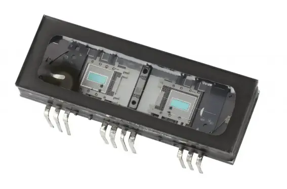
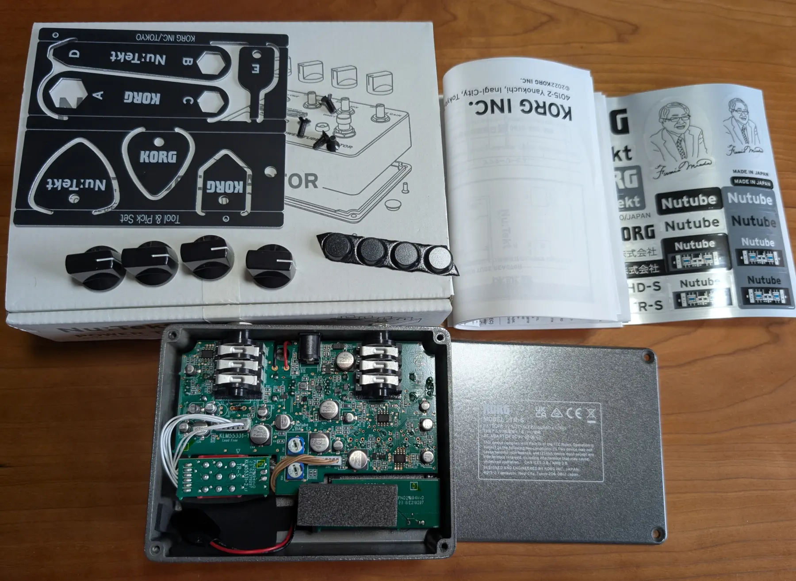

+++
title = "KORG Nu:tekt TR-S (POWER TUBE REACTOR)を試す"
description = "KORG Nu:tekt TR-S (POWER TUBE REACTOR)の詳細レビューです。Nutube技術による真空管パワー管のサグ感とコンプレッション感を再現するユニークなエフェクターで、アンプシミュレーターとの組み合わせでリアルな真空管サウンドを実現できます。"
date = 2025-08-01

[taxonomies]
tags = ["Guitar Pedals"]
[extra]
social_media_card = "ogp.webp"
+++

<!-- textlint-disable -->

{{ image(src="trs.webp", alt="KORG Nu:tekt TR-S") }}

<!-- textlint-enable -->

Table of Contents

<!-- toc -->

KORG Nu:tekt TR-S (POWER TUBE REACTOR)を購入しました。

## KORG Nu:tekt TR-S(POWER TUBE REACTOR)とは

KORG Nu:tekt TR-S(POWER TUBE REACTOR)は、KORGとノリタケ伊勢電子（株）が開発
した
[Nutube](https://korgnutube.com/)という蛍光表示管の技術を応用した新しい真空管
を使用したエフェクターです。

<figure>
  
  <footer>
    <figcaption>Nutube</figcaption>
  </footer>
</figure>

これまでNutubeを利用したオーバードライブやプリアンプはありましたが、
KORG Nu:tekt TR-Sはいわゆる歪み系のエフェクターでなく、
"POWER TUBE REACTOR"とネーミングされているように、真空管アンプのパワー管を
Nutubeでシミュレーションしてくるエフェクターです。

パワー管がプッシュされた時の飽和感や、コンプ感を再現してくれるものです。

一応組み立てキットですが、　ご覧のように既に基盤も完成しておりケースに設定さ
れています。必要なのは、ケースの裏ぶたをねじ止めして、つまみをセットするだけ
です。

<figure>
  
  <footer>
    <figcaption>KORG TR-Sの内包物</figcaption>
  </footer>
</figure>

## KORG TR-Sで弾いてみた

{{ youtube(id="5nHSZ8GDcSQ") }}

パワー管ということで、アンプシミュレーターのSimplifier MK-IIのSend - Returnに
KORG TR-Sをセットしてみましたが、インピーダンスの関係かSimplifier MK-II
のボリュームを最大にしないとほぼ反応しません。そのため普通にSimplifier MK-II
のインプットに挿しています。

かなりオーバーに掛けて弾いているとはっきりと違うのですが、
聞き手にはあまり伝わらないかも知れません。

クリーントーンでは、オーバードライブとは違うクリーンな響きに僅かに歪みのニュアンスが入ります。
パワー管がプッシュされた時のチリチリとした飽和感です。音は全体に角が取れて丸くなります。
オーバードライブを掛けると、アタックが押さえられコンプレッサー
とは違うコンプレッション感が付加されます。

あまり過度にかけると、引き始めの音がならずに時間差でサスティーンだけ出てくる
ことになるので、セッティングはかなり綿密にやったほうがよいです。

## KORG TR-Sの評価

派手なエフェクター入るわけでもなく、ネーミングも"POWER TUBE REACTOR"と馴染み
がないネーミングです。
なので、このエフェクターが何かなかなか理解されないのではないかと思います。

しかし、このエフェクターを組み込めば、驚くほど真空管アンプの「サグ感」のニュアンスを出す
ことができます。アンプシミュレーターでも、このエフェクターを後段に繋ぐだけで
、さらにリアルさを付加できます。

これほど真空管の挙動を再現したエフェクターはこれまでなかったのではないかと思
います。

ただ、結構セッティングがシビアなので、今回みたいに極端な設定では少し不自然さ
が増したりします。音を聞きながら最初にしっかり設定をする必要があります。

ただ、トリマーの3つのつまみは実は音への影響が大きく、セッティングではよくい
じることなると思うので、もう少しアクセスしやすい設置方法を考えて欲しかったで
す。

## まとめ

KORG Nu:tekt TR-S (POWER TUBE REACTOR)は、一見地味なエフェクターかもしれませんが、真空管アンプの「魂」とも言えるパワー管の挙動を忠実に再現する画期的な製品です。

特に以下のような方におすすめできます。

- アンプシミュレーターをより自然な響きにしたい方
- 真空管アンプの「サグ感」や「コンプレッション」を求める方
- 既存のセットアップにアナログ的な温かみを加えたい方

一方で、セッティングの繊細さや内部トリマーへのアクセス性など、日常的な使用において改善の余地もあります。しかし、これらの課題を上回る価値が、このNutube技術によるユニークなサウンドキャラクターにはあると感じます。

従来のオーバードライブやディストーションとは全く異なる、新しいカテゴリーのエフェクターとして、ギタリストの表現の幅を確実に広げてくれる一台です。
