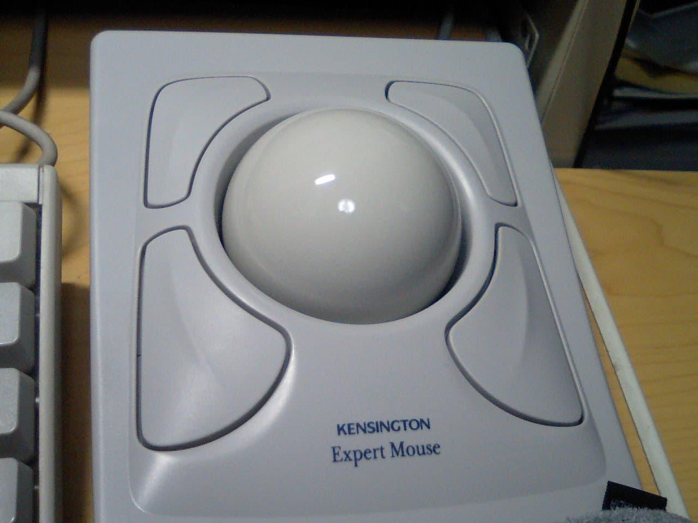

+++
title = "ロジクール MX ERGO Sレビュー"
description = "Amazonのプライム感謝先行セールで少し安くなっていたので、ロジクールのMX ERGO Sを購入しました。"
date = 2025-10-09

[taxonomies]
tags = ["Gadget"]
[extra]
social_media_card = "ogp.webp"
+++

<!-- textlint-disable -->

{{ image(src="ergo-s.webp", alt="MX ERGO S") }}

<!-- textlint-enable -->

Table of Contents

<!-- toc -->

20年程昔Kensigntonの機械式のExpertMouseを愛用してあの大玉を回す感覚が忘れられず、
定期的にトラックボールを購入してしまいます。今回もAmazonのセールだったので購入してみました。

<figure>
  
  <figcaption>忘れられないKensignton ExpertMouse</figcaption>
</figure>

## MX ERGO Sとは

ロジクールMX ERGO Sは昨年9月発売されたロジクールのトラックボールの最上位機種です。
2017年に発売されたMX ERGOの後継機種ですが、目に付く更新内容は次の通りです。

- 充電がUSB-Cに変更
- 専用レシーバーがUnifyingからLogiBoltに変更
- 静音クリック仕様に変更

7年越しの後継機種ですが、機能的にはほとんどアップデートされていないのが分かります。

最上位機種なので、マグネットの金属プレート台を利用して20度チルトできたり、やたらとボタンが付いていたりします。
ボタンは専用アプリを使用するとカスタマイズできますが、単に別の機能を割り振るだけでなく「ジェスチャー」機能を割り当てるとクリックだけでなく
トラックボールの上下左右の動きと合わせて機能設定できるため30近い機能を割り付けることが可能です。

## MX ERGO Sの評価

手首の痛み軽減を目的でトラックボールに移行される方が多いと思いますが、
私はマウスの利用で手首の痛みを感じたことがなのであまりピンと来ていません。

親指でボールを操作するトラックボールは、豪快に手のひらでボールを転がすExpertMouseとはやはり別物です。
どうしても「これじゃない」と感じてしまいます。

多ボタンもRectagleのショートカットを割り付けてみたりしましたが、
私はどちらかというとキーボード主体の操作なので、ショートカットをトラックボールに割り付けるならば
ショートカットを押下したほうが効率的です。

MX ERGO S本体はプラスチックにすべり止めの加工が施してあるようですが、これがベタベタした感触で
今にも加水分解しそうで苦手です。

結局、愛用している[Xtrfyの軽量ゲーミングマウス](https://amzn.to/4mRI8oB)で十分だと改めて感じてしまいました。

MX ERGO Sはヤフオクかメルカリでドナドナすることになりそうです。

<a href="https://hb.afl.rakuten.co.jp/hgc/g00tpxd5.9srin49d.g00tpxd5.9srio186/kaereba_main_202601301031135362?pc=https%3A%2F%2Fitem.rakuten.co.jp%2Flogicool%2Fmxtb2%2F&m=http%3A%2F%2Fm.rakuten.co.jp%2Flogicool%2Fi%2F10000683%2F&rafcid=wsc_i_is_1087413314923222742" target="_blank" >【特価】ロジクール ワイヤレスマウス トラックボール MX ERGO S 無線 静音 Bluetooth & Logi Bolt 8ボタン USB-C 急速充電 windows mac iPad OS 対応 MXTB2 国内正規品 2年間無償保証</a>
posted with <a href="https://kaereba.com" rel="nofollow" target="_blank">カエレバ</a>

<a href="https://hb.afl.rakuten.co.jp/hgc/1300574f.7d238558.13005750.4bcd8088/kaereba_main_202601301031135362?pc=https%3A%2F%2Fsearch.rakuten.co.jp%2Fsearch%2Fmall%2FMX%2520ERGO%2F-%2Ff.1-p.1-s.1-sf.0-st.A-v.2%3Fx%3D0%26scid%3Daf_ich_link_urltxt&m=http%3A%2F%2Fm.rakuten.co.jp%2F" target="_blank" >楽天市場</a>

<a href="https://www.amazon.co.jp/gp/search?keywords=MX%20ERGO&__mk_ja_JP=%E3%82%AB%E3%82%BF%E3%82%AB%E3%83%8A&tag=yostosweb-22" target="_blank" >Amazon</a>

