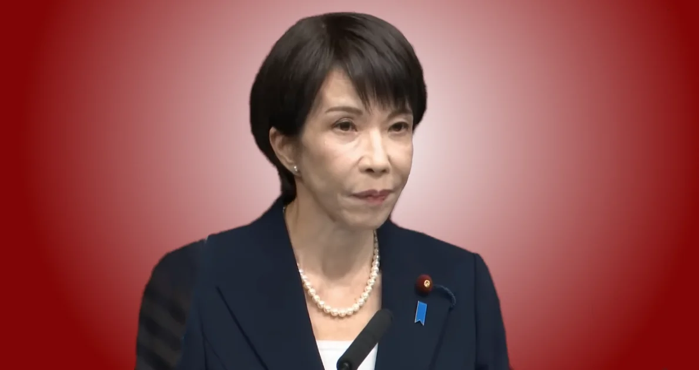

+++
title = "高市総理の衆議院解散表明 - 覚悟の政策転換"
description = """
高市総理の衆議院解散表明に胸が震えました。これほど多岐にわたる
具体的政策を掲げ、自らの進退を国民の判断に委ねた首相を、
私は知りません。覚悟の政策転換に込められた思いを綴ります。
"""
date = 2026-01-21

[taxonomies]
tags = ["Current Affairs", "Politics"]
[extra]
social_media_card = "ogp.webp"
+++

<figure>
  
  <figcaption>高市早苗内閣総理大臣 記者会見</figcaption>
</figure>

2026年1月21日、高市早苗内閣総理大臣が衆議院解散を表明しました。

小泉首相の郵政解散は郵政民営化の賛否を問う単一争点でした。高市首相は違います。財政・安保・インテリジェンス・税制・憲法改正と、国家の根幹に関わる複数の大転換を、具体的な数字と制度設計にまで踏み込んで語りました。そして「高市早苗に国家経営を託していただけるのか」と、自らの進退を国民の判断に委ねました。**これほど多岐にわたる具体的政策を掲げ、自らの進退を賭けた首相は過去に例を見ません**。

{{ youtube(id="v6674b-RsfY") }}

記者会見全文を読む

<!-- textlint-disable -->

<figure>
<blockquote cite="https://www.youtube.com/live/v6674b-RsfY">

*2026年1月21日*

*ただいまより、高市内閣総理大臣による記者会見を行います。はじめに総理からご発言がございます。では、総理よろしくお願いいたします。*

国民の皆様、私は本日、内閣総理大臣として1月23日に衆議院を解散する決断をいたしました。なぜ今なのか、高市早苗が内閣総理大臣で良いのかどうか、今、主権者たる国民の皆様に決めていただく、それしかない、そのように考えたからでございます。

日本列島を強く豊かに、今着手しなければ間に合いません。そのために高市内閣が取り組み始めたのは、全く新しい経済財政政策をはじめ、国の根幹に関わる重要政策の大転換です。私が自民党総裁選挙や、そして日本維新の会との連立政権合意書に書かれた政策など、大きな政策転換は今年の国会で審議される令和8年度予算や政府提出法案の形で本格化します。その多くが前回の衆議院選挙では自民党の政権公約には書かれていなかった政策です。また、前回の衆議院選挙の時には、私、高市早苗が日本の国家経営を担う可能性すら想定されていませんでした。

解散というのは重い重い決断です。逃げないため、先送りしないため、そして国民の皆様とご一緒に日本の進路を決めるための決断です。私自身も内閣総理大臣としての身体をかけます。高市早苗に国家経営を託していただけるのか、国民の皆様に直接ご判断をいただきたい。日本は議員内閣制の国ですから、国民の皆様が直接内閣総理大臣を選ぶことはできません。しかし、衆議院選挙は政権選択選挙と呼ばれます。自民党と日本維新の会で過半数の議席を賜れましたら高市総理、そうでなければ野田総理か斉藤総理か別の方か、間接的ですが国民の皆様に内閣総理大臣を選んでいただくことにもなります。

今、衆議院でも参議院でも過半数の議席を持たない自民党の総裁が内閣総理大臣を務めている。また、前回の衆議院選挙では自民党・公明党の連立政権を前提に国民の皆様の審判を仰ぎました。今や連立政権の枠組みも変わりました。だからこそ、政治の側の都合ではなく、国民の皆様の意志に正面から問いかける道を選びました。

私は3回目の挑戦で、昨年10月4日に自民党総裁に就任しました。その直後に26年間も連立パートナーだった公明党との突然の別れ。自民党総裁にはなったものの、衆議院でも参議院でも自民党が過半数の議席を得られていない中での国会での首班指名選挙に臨むことになりました。内閣総理大臣に就任するための道は険しいものでした。新たに連立パートナーとなった日本維新の会の皆様をはじめ、衆参両院で他の会派の皆様のお力添えもいただいて、薄氷を踏む思いで何とか首班指名選挙では勝利し、昨年10月21日に内閣総理大臣に就任しました。

この日から、高市内閣が政権選択選挙の洗礼を受けていないということをずっと気にかけてまいりました。しかしながら、特に国民の皆様が直面する物価高対策については、これはもう待ったなしの課題でございました。高市内閣として速やかに対策を打つ必要がありました。

高市内閣が編成した令和7年度補正予算で措置したガソリン・軽油の値下げ、電気代・ガス代支援、重点支援地方交付金、物価高対応子育て応援手当により、一世帯あたり標準的には年間8万円を超える支援額となることが見込まれます。ガソリンと軽油の価格については、補助金も活用したことで、すでに値下がりしています。電気代とガス代の支援も、まさに今月から始まっています。

高市内閣の発足時、私たちの命を守る医療機関の多くが赤字で、介護事業者の倒産件数は過去最高でした。必要な医療が受けられなくなる、ご高齢の方や障害をお持ちの方が居場所がなくなってしまう、大きな危機感を抱き続けてまいりました。赤字の医療機関・介護事業者を中心に、報酬改定を待たずに前倒しで医療・介護等支援パッケージを補正予算に盛り込みました。また、介護従事者や介護職員の皆様に対し、幅広く月1万円から最大1.9万円の賃上げ支援を実施することとしました。

各省庁や地方自治体には7年度補正予算の早期執行を要請しました。物価高対策を含む生活の安全保障については、順次必要な対策が進んでいる最中です。経済運営に空白を作らない万全の体制を整えた上での解散であることを、ここに明確に申し上げます。

当面の対策を打つことができたこのタイミングで、政策実現のためのギアをもう一段上げていきたい。拉致問題の解決に向けて、首脳同士で正面から向き合い、具体的な成果に結びつけたい。また、国論を二分するような大胆な政策改革にも果敢に挑戦していきたい。昨年末までに衆議院と参議院で本会議で質疑を受け、二巡の予算委員会審議に対応する中で、その思いはますます募りました。不安定な日本政治の現状、永田町の厳しい現実を痛いほど実感したこの3ヶ月間でもありました。

「信なくば立たず」であります。重要な政策転換について国民の皆様に正面からお示しし、その是非について堂々と審判を仰ぐことが、民主主義国家のリーダーの責務だと考えました。

その本丸は「責任ある積極財政」です。これまでの経済財政政策を大きく転換するものです。行き過ぎた緊縮志向、未来への投資不足、この流れを高市内閣で終わらせます。様々なリスクを最小化し、先端技術を花開かせるための戦略的な財政出動は、私たちの暮らしの安全安心を確保するとともに、雇用と所得を増やし、消費マインドを改善し、事業収益が上がり、税率を上げずとも税収が自然増に向かう強い経済を実現する取り組みです。

第一の柱は、リスクを最小化する危機管理投資です。例えば、食料安全保障の確立により、何があっても食べ物に困らない日本を作る。すべての農地をフル活用できる環境を整え、農業にも林業にも漁業にも最新の技術を活用し、日本の食品を広く世界市場に展開することによって、国内外で需要を増やしながら供給力も強くします。日本のスタートアップが世界トップレベルの技術を誇る完全閉鎖型植物工場や陸上養殖施設の海外展開でも、日本は大いに稼げます。

また、エネルギー・資源安全保障の強化も重要です。電力を安定的に安価に供給できる対策を講ずることは、私たちの暮らしと日本の産業を守るために必要なことです。エネルギーの技術を展開することが必要です。日本で発明されたペロブスカイト太陽電池の普及、小型モジュール炉など次世代革新炉や日本企業の技術が優位性を持つフュージョンエネルギーの早期社会実装、液浸冷却技術や光電融合技術などによる省エネ型データセンターの普及、酸化物型全固体電池の社会実装など、日本の強みを生かさなければもったいない。

経済安全保障も重要です。重要鉱物やお薬の原料などを一部の国に供給のほとんどを頼るということは、大きなリスクを伴います。高市内閣は、日本の自立性を高めるべく、資源や原料の国産化や調達先の多角化に向けた取り組みに既に着手しています。日本の技術や製品がなければ世界中が困る、日本の不可欠性は我が国の平和を守る手段にもなります。

このほか、災害から現在と未来の命を守る国土強靱化、医療・健康安全保障、サイバーセキュリティの強化など、危機管理投資を着実に進めます。世界共通の課題を解決する製品・サービス・インフラをいち早く国内で社会実装し、海外市場に展開することにより、私たちの安心の確保のみならず、経済成長にもつなげていきます。

欧米においても、政府が一歩前に出て官民が手を取り合って重要な社会課題の解決を目指す、新たな産業政策が大きな潮流となっています。しかし、私たちは長年そうした投資を十分には行ってきませんでした。国民の皆様の命と暮らしを守る、これは国の究極の使命です。不安を安心と希望へと変えていくために、大胆な危機管理投資が必要です。今そこにある危機に対して、行き過ぎた緊縮財政の呪縛を乗り越え、すぐにでも着手する責任があります。

第二の柱は、成長投資です。すでに高市内閣の日本成長戦略本部で定めた戦略17分野をはじめ、日本が優位性を有する技術を活かしたビジネス展開の促進、基礎研究分野を含めた人材力や研究開発力の強化、スタートアップ支援の強化など、新技術立国を実現します。また、地域発のアイデア創出を募り、大胆な投資促進策やインフラ整備を一体的に講ずることで、産業クラスターを全国各地に戦略的に形成します。

47都道府県のどこに住んでいても、安全に生活することができて、必要な医療や福祉や高度な教育を受けることができて、働く場所がある。「日本列島を強く豊かに」、高市内閣が目指す日本の姿です。そのためにも強い経済が必要です。

高市内閣は国の予算の作り方を根本から改めます。毎年度補正予算が組まれることを前提とした予算編成手法と決別し、必要な予算は当初予算で措置します。また、成果管理を徹底することを前提に、複数年度の財政出動をコミットする仕組みを構築します。これは、財政支出の予見可能性を高め、危機管理投資や成長投資に関して、民間事業者の方々に安心して設備投資や研究開発をしていただくためです。

令和8年度当初予算はその第一歩です。頭出しをしました。しかしながら、8年度予算の概算要求は私の就任前に終わっていました。よって、シーリングを含めた予算編成の方針の見直しは、今年の夏の概算要求の段階から取り組み、翌年度に予算を成立させるまでに2年の時間を要する大改革です。でも、必ずややり抜いてまいります。

高市内閣がこれまでに講じた物価高対策により、今年は実質賃金の伸びのプラス化が見込まれます。しかしながら、食料品の物価上昇率は高止まりする見通しです。強い経済実現のためには、国民の皆様の手取りを増やし、実質賃金上昇を確実なものとし、改善された消費マインドが経済の好循環を牽引する姿が必要です。

物価高に苦しんでおられる中所得・低所得の皆様の負担を減らす上でも、現在軽減税率が適用されている飲食料品については、2年間に限り消費税の対象としないこと。これは昨年10月20日に私が署名した自民党と日本維新の会の連立政権合意書に書いた政策でもあり、私自身の悲願でもありました。今後設置される国民会議において、財源やスケジュールのあり方など、実現に向けた検討を加速します。

私の内閣総理大臣就任以来、株価は上昇しています。国民の皆様の大切な年金は株式によっても運用されています。強い経済の実現は、将来への不安を安心へと変えるものでもあります。こうした大胆な経済財政政策の転換により、経済の好循環を実現します。

過去最大規模となった令和8年度予算については、やりすぎだといった批判もございます。しかし、8年度予算では財政の持続可能性にしっかり配慮した結果、プライマリーバランスが28年ぶりに黒字化しました。8年度の政策のために必要な予算は、借金でなくまかなうことができた。借金で新しい政策を実施するわけではありません。

8年度予算では新規の国債発行額も29.6兆円に抑えました。リーマンショック後2番目に低い水準です。税収が増える中で、予算全体の公債への依存度も金融危機収束以降最も低い水準に抑えることができました。これこそが私が目指す「責任ある積極財政」のもとでの強い経済の実現です。

今後も成長率の範囲内に債務残高の伸び率を抑え、政府債務残高の対GDP比を引き下げていきます。それにより財政の持続可能性を実現します。具体的で客観的な指標を明示しながら、マーケットからの信認を確保していきます。

そして、国民の皆様の支持なくして、力強い外交・安全保障を展開していくこともできません。国際情勢はさらに厳しさを増しています。中国軍が台湾周辺で軍事演習を行いました。世界が依存し、民生用にも広く用いられるサプライチェーン上流の物資を管理下に置くことで、自国の主張に他国を屈服させようとする経済的威圧の動きも見られます。

我が国が「自由で開かれたインド太平洋」を提唱してから10年、その進化を目指します。これまで、ASEAN関連首脳会議、APEC首脳会合、トランプ大統領との首脳会談、G20サミット、中央アジア＋日本首脳会談、ゼレンスキー大統領やメローニ首相との会談をはじめ、国際会議の機会を利用した数多くの各国首脳との二国間会談など、数々の貴重な外交機会に恵まれました。

日米同盟を基軸に、日米韓、日米フィリピン、日米オーストラリア、日本・イタリア・イギリス（グローバルサウス）などとの連携をさらに強化してまいります。

そして、安全保障政策を抜本的に強化します。国家安全保障戦略、国家防衛戦略、防衛力整備計画、いわゆる戦略三文書を前倒しで改定します。ロシアのウクライナ侵略後、各国は無人機の大量運用を含む新しい戦い方、さらに一旦そういった事態が起きた場合、長期化する可能性が高いという想定のもと、長期戦への備えを急いでいます。これは前回戦略三文書を改定した2022年と比べて大きな変化です。その改定は急務であり、かつ旧来の議論の延長ではない抜本的な改定が必要です。

抑止力のさらなる強化、サイバー・宇宙・電磁波など新領域への着実な対応、防衛産業・技術基盤のさらなる強化、自衛官の処遇の改善。自らの国を自らの手で守る、その覚悟のない国を誰も助けてはくれません。日本の平和と独立、国民の皆様の命を守り抜くために、現実的で強靱な安全保障政策へと踏み出してまいります。

インテリジェンス機能の強化も、国民の皆様の支持なくしては実現できない大きな課題です。十分な情報を集め、分析し、正確な判断を行う能力、つまり情報力が強くなければ、外交力も防衛力も経済力も技術力も強くはなりません。国家としての情報分析能力を高め、危機を未然に防ぎ、国益を戦略的に守る体制を整えます。

具体的には、国家としての情報力を強化する「国家情報局」の設置、外国から日本への投資の安全保障上の審査体制を強化する「対日外国投資委員会」の設置、インテリジェンス・スパイ防止関連法の制定です。これらすべてが急がれます。

また、私が自民党総裁選挙で訴えていた「給付付き税額控除」は、特に社会保険料の逆進性に苦しむ中所得層の手取りを増やせる政策です。その制度設計を含む持続可能な社会保障制度の構築は、党派を超えて日本の英知を結集して取り組むべき急務でございます。

そして、皇室典範と日本国憲法の改正、長年にわたり手がつけられてこなかった課題に正面から取り組みます。こうした重要政策は、安定した政治基盤と国民の皆様の明確な信任がなければ実現できません。曖昧な政治ではなく、進むべき方向を明確に示し、国民の皆様に堂々と信を問いたい。その覚悟で解散を決断しました。

自民党自身も変わらなければなりません。責任ある積極財政にも、安全保障政策の抜本強化にも、さまざまな批判があります。それでもなお、すべては国民の皆様のため、一糸乱れることなく政策の実行に打ち込んでいく。それなくして国民の皆様の信頼を得ることはできません。

昨年10月の自民党総裁選挙は熾烈な戦いでした。活発な政策論争を経て私が総裁に選ばれましたが、これはあくまで自民党員の皆様による審判を受けたに過ぎません。今回は特に大きく変わる一部の政策だけをご紹介しましたが、これらを含めて自民党が政権公約として掲げ、国民の皆様の審判を受ける。そして選挙が終わればその公約の実現に向けて、党一丸となって突き進んでいく。それは自民党が国民政党の原点に立ち戻るための戦いでもあります。

私は内閣総理大臣に就任して以来、国会の開会中であっても閉会中であっても、日本にいても海外にいても、働いて働いて働いて働いて働いて働いて働いてまいりました。選挙期間中も高市内閣は各府省庁の職員と共に働き続けます。

解散総選挙によって令和8年度予算の年度内成立は極めて困難になるのではないかとも言われています。その影響を最小限にとどめるため、1月23日に衆議院を解散した後、1月27日に公示、2月8日の投開票のスケジュールとすることで、速やかに総選挙を実施する考えです。

その上で、責任ある積極財政に賛同してくださる各党の皆様と力を合わせて、8年度予算の成立を可能な限り早く実現したい。それでも暫定予算の編成が必要になるかもしれません。その場合にも、高市内閣として4月からの実施を決定している、いわゆる高校の無償化、給食費無償化の予算については、関連法案の年度内成立や暫定予算の計上など、あらゆる努力をして実現してまいります。

むしろ選挙で国民の皆様の信任を賜ることができたら、その後の政策実現のスピードを加速することができると考えています。

これまで26年間にわたり、公明党の支持者の皆様には選挙のたびに自民党に多大なるご支援をいただいてきました。暑い真夏の選挙戦も、寒風吹き荒ぶ真冬の選挙も、街頭で、集会場で、あぜ道で、共に汗をかき、共に声を枯らして選挙を戦ってきました。今回の選挙では袂を分かつ結果となりましたが、改めて四半世紀の長きにわたるご支援に感謝を申し上げます。

同時に、自民党にとっては厳しい選挙戦になることを覚悟しなければならない。自民党の同志たちは公明党の支援を受けることができない。それだけではありません。わずか半年前の参議院選挙で共に戦った相手である立憲民主党に所属しておられた方々を、かつての友党が支援する。少し寂しい気持ちもいたしますが、これが現実です。

国民不在、選挙目当ての政治、永田町の論理に終止符を打たねばなりません。新しい国づくりへと踏み出します。

10年前の安倍晋三元総理大臣の言葉が思い出されます。「困難は元より覚悟の上です。しかし、未来は他人から与えられるものではありません。私たちが自らの手で切り開いていくものであります。」

今の日本にまさに必要な言葉です。挑戦しない国に未来はありません。守るだけの政治に希望は生まれません。希望ある未来は待っていてもやってこない。誰かが作ってくれるものでもない。私たち自身が決断し、行動し、作り上げていくものです。

だから私は今回の選挙、「自分たちで未来をつくる選挙」と名付けました。日本の未来は明るい、日本にはチャンスがある、みんなが自信を持ってそう言える、そう実感できる社会を作りたい。挑戦する人が評価され、頑張る人が報われ、困った時には助け合い、安心して家庭を持ち、夢をもって働ける国へ。私はその先頭に立ちたい。

だから私は逃げません。ぶれません。決断します。未来に責任を持つ政治を貫いてまいります。

今日生まれた赤ちゃんも、今年初めて投票する18歳の若者も、その多くは22世紀の日本を見ることができるでしょう。その時に日本という国が安全で豊かであるように、インド太平洋の輝く灯台となって、自由と民主主義の国として仰ぎ見られる日本であるように。

私は日本と日本人の底力を信じてやみません。日本の成長のスイッチを押しまくり、その可能性を解き放ちます。世界の真ん中で咲き誇る日本外交を実現します。

私、高市早苗は、内閣総理大臣として、様々な改革に取り組み、大きな政策転換を進めていきます。その道をご一緒に前に進んでいただけるのか、それとも不安定な政治の下で立ち止まってしまうのか、その選択を主権者である国民の皆様に委ねたいんです。

私は前に進みたい。国民の皆様と共に。日本はもっと強くなれる。日本はもっと豊かになれる。日本はもっと希望に満ちた国になれる。その未来を共に作りましょう。

改めて申し上げます。「日本列島を強く豊かに」、共に新しい時代を切り開いてまいりましょう。

結びに申し上げます。選挙は民主主義の根幹とはいえ、真冬の選挙戦です。特に雪国の皆様には、足元の悪い中、投票所まで大変なご足労をいただきますことを恐縮に存じます。また、年度末が近づくご多忙の時期に選挙業務に携わっていただく自治体の皆様に、心から感謝を申し上げます。

私からは以上です。ありがとうございます。

</blockquote>
<figcaption>
— <cite><a href="https://www.youtube.com/live/v6674b-RsfY">高市内閣総理大臣記者会見－令和8年1月19日</a></cite>より文字起こし
</figcaption>
</figure>

<!-- textlint-enable -->

## 評価できる点

### 明確な解散理由と覚悟の提示

高市首相は「政権選択選挙の洗礼を受けていない」という正統性の問題を自ら認め、国民に信を問う姿勢を示しました。「信なくば立たず」という原則に基づく論理的な解散理由であり、「高市早苗に国家経営を託していただけるのか」と自らの身体をかける覚悟を表明しています。

### 政策の具体性

経済財政政策の本丸として「責任ある積極財政」を掲げました。第一の柱は危機管理投資です。食料安全保障、エネルギー・資源安全保障、経済安全保障、国土強靱化といった分野への投資を進めます。第二の柱は成長投資で、戦略17分野を定め、新技術立国の実現と産業クラスターの形成を目指します。

具体的な数字も示されました。一世帯あたり年間8万円超の支援額、プライマリーバランスの28年ぶりの黒字化、新規国債発行額29.6兆円（リーマンショック後2番目に低い水準）といった数値です。

技術分野にも踏み込んでいます。ペロブスカイト太陽電池、小型モジュール炉（SMR）や次世代革新炉、フュージョンエネルギー、液浸冷却技術や光電融合技術、酸化物型全固体電池、完全閉鎖型植物工場や陸上養殖施設といった具体的な技術名を挙げました。

### 財政規律への配慮

「借金で新しい政策を実施するわけではない」と明言した点も重要です。成長率の範囲内に債務残高の伸び率を抑制し、政府債務残高の対GDP比を引き下げていくと目標を明示しています。「責任ある積極財政」として、積極財政と財政規律の両立を志向している点は評価できます。

### 安全保障政策の抜本強化

戦略三文書（国家安全保障戦略、国家防衛戦略、防衛力整備計画）の前倒し改定を表明しました。ウクライナ戦争後、各国は無人機の大量運用を含む新しい戦い方や長期戦への備えを急いでいます。これは前回戦略三文書を改定した2022年と比べて大きな変化であり、その改定は急務だという認識です。

具体的施策としては、抑止力のさらなる強化、サイバー・宇宙・電磁波など新領域への対応、防衛産業・技術基盤の強化、自衛官の処遇改善を挙げています。

### インテリジェンス機能の強化

この点は個人的に最も注目しています。G7諸国との比較で見ると、日本の現状は明らかに遅れています。

| 国       | スパイ防止関連法制   | 主要情報機関       |
| -------- | -------------------- | ------------------ |
| 米国     | Espionage Act等      | CIA、FBI、NSA      |
| 英国     | Official Secrets Act | MI5、MI6           |
| ドイツ   | 刑法典第94条等       | BfV、BND           |
| フランス | 刑法典411条等        | DGSI、DGSE         |
| 日本     | 具体的な法律なし     | 内調（権限限定的） |

高市首相は国家情報局の設置、対日外国投資委員会の設置、インテリジェンス・スパイ防止関連法の制定を掲げました。歴代首相が避けてきたこの課題に正面から取り組む姿勢は、地政学的リスクが高まる中で評価すべき点だと考えます。

### 選挙日程への配慮

予算成立への影響を最小化するため、最短日程を設定しました。1月23日に衆議院を解散し、1月27日に公示、2月8日に投開票という日程です。高校無償化・給食費無償化については暫定予算でも実現すると約束しています。

### 外交方針の明確化

「自由で開かれたインド太平洋」の進化を掲げ、日米同盟を基軸とした多国間連携を推進する方針を示しました。日米韓、日米フィリピン、日米オーストラリア、日本・イタリア・イギリスなどとの連携強化を進めます。拉致問題解決への意欲も表明しています。

## 過去の首相との比較

解散表明の具体性という観点で、過去の首相と比較してみました。

| 首相               | 解散名                     | 特徴                                         |
| ------------------ | -------------------------- | -------------------------------------------- |
| 小泉純一郎（2005） | 郵政解散                   | 「賛成か反対か」単一争点。明確だが範囲が狭い |
| 安倍晋三（2014）   | 消費税延期                 | 増税延期の是非を問う。限定的                 |
| 安倍晋三（2017）   | 国難突破                   | 北朝鮮情勢・消費税使途変更。抽象的           |
| 岸田文雄（2021）   | 就任直後                   | 「新しい資本主義」。具体性に欠ける           |
| 高市早苗（2026）   | 自分たちで未来をつくる選挙 | 多分野にわたる具体的政策転換を明示           |

### 高市首相の特異性

今回のスピーチで示されたコミットメントの範囲は極めて広いです。財政政策では予算編成手法の根本改革と複数年度コミットを掲げました。具体的数字としてPB28年ぶり黒字、国債29.6兆円、支援額8万円を示しました。技術分野ではペロブスカイト、SMR、フュージョン、全固体電池といった具体名を挙げました。制度面では国家情報局、対日外国投資委員会、スパイ防止法の新設を掲げました。安保改革として戦略三文書の前倒し改定、税制では飲食料品の消費税2年間免除、社会保障では給付付き税額控除の制度設計、そして皇室典範と日本国憲法の改正にまで言及しました。

これほど多岐にわたる具体的政策を解散表明で明示した首相は過去に例を見ません。

小泉首相は「明確さ」では際立っていましたが、争点は郵政民営化の一点でした。高市首相は経済財政・安全保障・インテリジェンス・税制・憲法と、国家の根幹に関わる複数の大転換を同時に掲げています。

「後で言い逃れできない」レベルで具体的に語っている点で、過去に例を見ない覚悟の表明だと感じました。

## 総評

高市首相の衆議院解散表明は、歴史的なスピーチだと評価できます。

第一に、正統性への誠実な向き合いです。政権選択選挙を経ていないことを自ら認め、信を問う姿勢を示しました。第二に、政策の具体性です。抽象的なスローガンではなく、数字・技術・制度を具体的に提示しました。第三に、覚悟の表明です。多岐にわたるコミットメントにより、後退の余地を自ら封じています。第四に、歴代首相が避けてきた課題への挑戦です。スパイ防止法、憲法改正といった困難な課題に正面から取り組む姿勢を示しました。

「日本列島を強く豊かに」というビジョンのもと、責任ある積極財政、安全保障の抜本強化、インテリジェンス機能の確立という三本柱を明確に打ち出しました。

> だから私は逃げません。ぶれません。決断します。未来に責任を持つ政治を貫いてまいります。

選挙の結果がどうなるかは分かりません。しかし、これほど明確に政策を掲げて信を問う姿勢は、日本の政治において久しく見なかったものだと思います。
